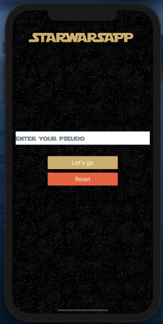
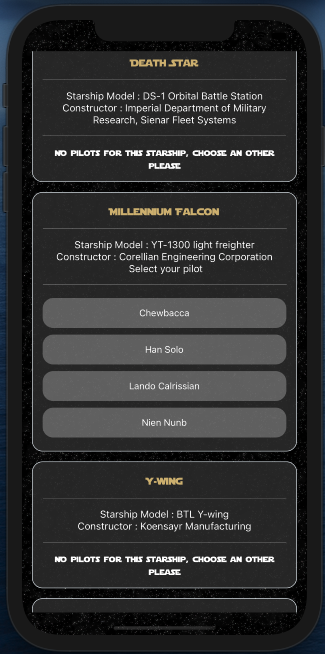
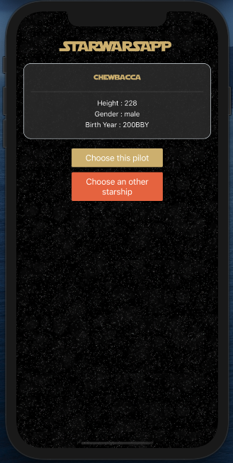
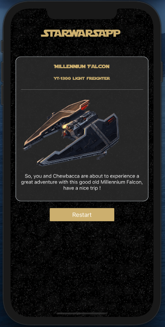

# StarWarsApp
StarWarsApp is a mobile application made with ReactNative library who you can watch the some differents starships, pilots and their description, from the Star Wars saga.






### Run it locally 

1. Install [Expo CLI](https://docs.expo.io/workflow/expo-cli/?redirected) 
```
[sudo] yarn global add expo-cli | npm install -g expo-cli
```
2. Clone the project StarWarsApp
```
git clone https://github.com/romgrm/StarWarsApp.git
```
3. Install dependencies 
```
cd StarWarsApp
yarn install | npm install
```
4. Run the app 
```
yarn start | npm start
``` 

You can run the app on your devices (android|iphone) or on the web with following expo steps.
The project was developed with a mobile language so it is more suitable to see it on a mobile format (F12 => IphoneX) 

### IDEA OF THE PROJECT
* The goal is to consume the SWAPI API in order to display a list of starships, as well as their pilots.
* To add a bit of difficulty, I chose to do a sort of route with the selection of a starship, then a pilot, to arrive at a final summary. 
* All with a design reminiscent of the star wars universe

### TECHNICAL PARTS 
* I chose to use React Native because it is my favorite language and for this kind of project it is perfectly suited
* Another difficulty, I had never used RN with Typescript until this project but for the challenge I did. 
* I made a classic architecture: screens, powered by components, typed by interfaces with a transmission of parent / child and global state properties. 
* I could have used different global states with the API context for each data (starships, pilots ...) but that added code for an app that is not called to evolve and where all the screens are linked with a logic parent / child, therefore not really of interest.
* I used react navigation and react native elements as the main library.

### IMPROVEMENT 
* I would have liked to have made a cleaner, MVC-style architecture, a bit like Angular, where my services contain my business logic and my screens display just the view, but I didn't have a lot of time and I found myself stuck with browsing and passing parent / child props with this type of architecture, so I went back to the basic one.
* I would have liked to improve the css, in particular the swipeable elements to correspond more to a mobile app but I do not know on which display the app will be read so I did it as easy as possible. 
* Finally, when I have more time, I would test this exercise with Angular, I'm sure that with observables and service injections, fetching and data transmission will be much easier.